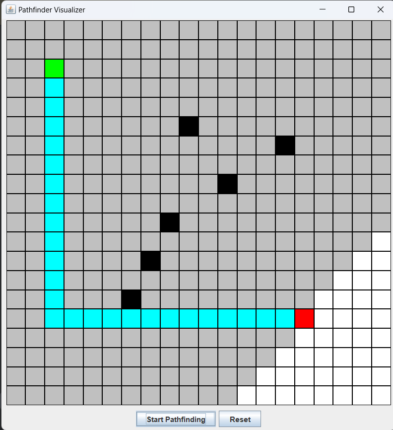

# Pathfinder Visualizer with Graphical User Interface (GUI)

## Overview
This is a **Pathfinder Visualizer** application built using **Java Swing**. It allows users to create a grid, set a start and end point, add obstacles, and visualize a pathfinding algorithm in action. The program uses **Breadth-First Search (BFS)** to find the shortest path between the start and end points.

---

## Features
1. **Interactive Grid**:
    - Users can click on the grid to set start, end, and obstacle cells.
2. **Dynamic Visualization**:
    - The pathfinding process is visualized step-by-step on the grid.
3. **Reset Functionality**:
    - Clear the grid and start a new visualization.
4. **GUI Design**:
    - Clean and intuitive interface for easy interaction.

---

## Methods Used

### **Core Algorithm**
- **Breadth-First Search (BFS)**:
    - Explores all possible paths layer by layer to find the shortest path.
    - Stops once the end point is reached.

### **Core Methods**
1. **`findPath()`**:
    - Implements BFS to find the shortest path.
    - Updates the grid dynamically during the search.
2. **`drawPath(Map<Cell, Cell> parentMap)`**:
    - Uses the parent map generated by BFS to backtrack and display the shortest path.
3. **`isValidMove(int row, int col, boolean[][] visited)`**:
    - Checks if a move is valid (within bounds, not visited, and not an obstacle).
4. **Cell Actions**:
    - `setAsStart()`: Marks a cell as the starting point.
    - `setAsEnd()`: Marks a cell as the ending point.
    - `toggleObstacle()`: Toggles a cell between obstacle and empty.
    - `setVisited()`: Marks a cell as visited during the BFS process.
    - `reset()`: Resets the cell to its initial state.

---

## How to Use
1. **Run the Program**:
    - Execute the `PathfinderVisualizerGUI` class.
2. **Set Start and End Points**:
    - Left-click on the grid to set the starting point (green).
    - Left-click again to set the ending point (red).
3. **Add Obstacles**:
    - Click on additional cells to toggle them as obstacles (black).
4. **Start Visualization**:
    - Click the "Start Pathfinding" button to begin the visualization.
5. **Reset Grid**:
    - Click the "Reset" button to clear the grid and start over.

---

## Example

### Initial Setup:
- **Green Cell**: Start point.
- **Red Cell**: End point.
- **Black Cells**: Obstacles.

### Visualization in Progress:
- **Light Gray Cells**: Visited cells during BFS.
- **Cyan Cells**: The shortest path from the start to the end.

---

### **Output Example**
#### **1. Initial Grid**:
A blank grid where users set:
- **Start Point (Green)**: At cell (2, 2).
- **End Point (Red)**: At cell (15, 15).
- **Obstacles (Black)**: Multiple cells between the start and end points.

#### **2. During Pathfinding**:
- BFS explores cells, marking them **Light Gray**.

#### **3. After Completion**:
- The shortest path is displayed in **Cyan**.

---

